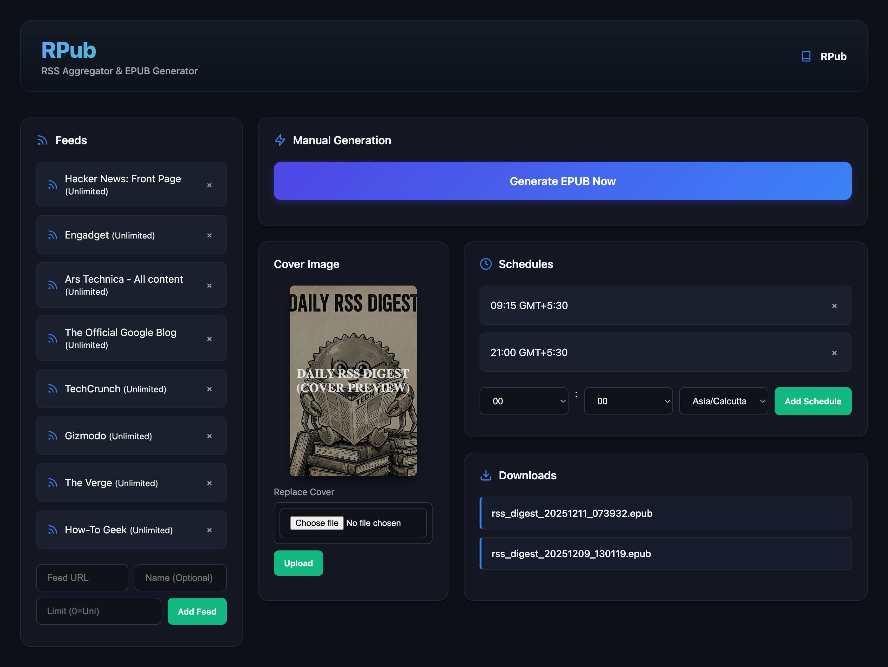

# rpub
[](https://app.koyeb.com/deploy?name=rpub&type=docker&image=harshit181%2Frpub%3Alatest&instance_type=eco-nano&regions=sin&env%5BRPUB_PASSWORD%5D=root&env%5BRPUB_USERNAME%5D=root&ports=3000%3Bhttp%3B%2F&hc_protocol%5B3000%5D=tcp&hc_grace_period%5B3000%5D=5&hc_interval%5B3000%5D=30&hc_restart_limit%5B3000%5D=3&hc_timeout%5B3000%5D=5&hc_path%5B3000%5D=%2F&hc_method%5B3000%5D=get)

**rpub** is a self-hosted Rust application that turns your favorite RSS/Atom feeds into a personal daily newspaper (EPUB). It fetches articles, processes images, and bundles everything into an EPUB file that you can read on your e-reader or tablet.

It also serves an OPDS feed, making it easy to download the generated EPUBs directly to compatible readers (like KOReader, Moon+ Reader, etc.).



## Roadmap

- [x] Add email send option for Kindle
- [ ] Make it multi-platform via Tauri or Dioxus
- [ ] Add configuration for few of the hardcoded settings

## Features

- **RSS/Atom Parsing:** Automatically fetches and parses content from your configured feeds.
- **EPUB Generation:** Compiles articles into a well-formatted EPUB ebook.
- **Image Optimization:** Downloads and processes images for optimal e-reader viewing (grayscale, resizing).
- **Web Interface:** A simple web UI to manage feeds, schedules, and manually trigger generation.
- **OPDS Catalog:** Built-in OPDS server (`/opds`) to browse and download generated EPUBs.
- **Scheduling:** Automated generation based on cron expressions.
- **Authentication:** Optional Basic Authentication to protect your instance.
- **Email Delivery:** Automatically send generated EPUBs to a configured email address.
- **Performance:** Built with Rust, Axum, and Tokio for high performance and low resource usage. Includes optional `libvips` support for efficient image processing.

## Getting Started

### Prerequisites

- Rust (latest stable)
- `sqlite3` (usually included in most OS)
- (Optional) `libvips` if using the `mem_opt` feature for optimized image processing.

### Installation

1.  Clone the repository:
    ```bash
    git clone https://github.com/yourusername/rpub.git
    cd rpub
    ```

2.  Run the application:
    ```bash
    cargo run
    ```
    The server will start at `http://0.0.0.0:3000`.

### Docker

You can also run **rpub** using Docker Compose.

1.  Make sure you have Docker and Docker Compose installed.
2.  Run the application:
    ```bash
    docker-compose up -d
    ```
    The server will start at `http://localhost:3000`.

**Manual Build:**

To build the Docker image manually:

```bash
docker build -t rpub .
```

To run the container:
```bash
docker run -p 3000:3000 -v $(pwd)/data:/app/data -v $(pwd)/static/epubs:/app/static/epubs rpub
```

### Usage

1.  **Open the Web UI:** Navigate to `http://localhost:3000` in your browser.
2.  **Add Feeds:** Use the interface to add the RSS/Atom feed URLs you want to follow.
3.  **Generate EPUB:** Click the "Generate" button (or configure a schedule) to create an EPUB from the latest articles.
4.  **Download:**
    - **Direct Download:** Download generated EPUBs from the "Downloads" section in the UI.
    - **OPDS:** Add `http://<your-server-ip>:3000/opds` to your e-reader's OPDS catalog list.

### Email Configuration

You can configure the application to automatically send generated EPUBs via email (e.g., to your Send-to-Kindle address).

- **Gmail Configuration:** Tested with `smtp.gmail.com` on port `587`.
- **App Password:** If using Gmail, you must use an **App Password** (your regular password will not work).
- **Recommendation:** It is recommended to use a **temporary or dedicated email account** for this feature, rather than your primary personal account.

### Configuration

You can configure the application using environment variables:

-   `RPUB_USERNAME`: Set a username for Basic Authentication.
-   `RPUB_PASSWORD`: Set a password for Basic Authentication.

If these variables are set, the Web UI and API (except `/opds`) will require authentication.

### Building with Optimization (Optional)

For better memory usage during image processing (recommended for low-memory devices), you can enable the `mem_opt` feature (requires `libvips` installed on your system):

```bash
cargo run --features mem_opt
```

## Architecture

-   **Backend:** Rust (Axum, Tokio)
-   **Database:** SQLite (Rusqlite)
-   **Frontend:** Static HTML/CSS/JS served by Axum
-   **Image Processing:** `image` crate (default) or `libvips` (optional)


## License

[MIT License](LICENSE)
